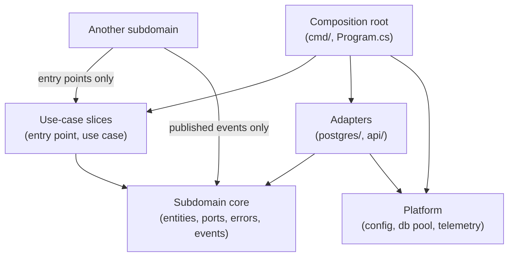

# Project Structure: Vertical Slices with Clean Architecture

## Summary

Projects generated by the `go_software_architect`, language engineers, and related agents follow a two-level organization within each service:

1. **Subdomains** (business capabilities like "patterns" or "enrichment") that own a coherent domain model.
2. **Use-case slices** (operations like "create" or "search") inside each subdomain: the handler, use-case logic, and ports for that operation only.

The **core** of each subdomain holds entities, value objects, domain errors, ports shared by two or more slices, and published domain events. The **platform** holds frameworks and drivers shared across subdomains (config, database pool, telemetry, HTTP server). The **composition root** (e.g., `cmd/server/` in Go) wires concrete adapters into slices. Dependencies point inward: slices and adapters depend on the core; the core depends on nothing in slices, adapters, or frameworks.

## Layout

### The Two Levels and Platform

- **Subdomain**: a module boundary that owns a coherent domain model.
- **Use-case slice**: one operation with its entry point, logic, and slice-local ports.
- **Platform**: shared configuration, database connections, telemetry, HTTP server, message queue.
- **Composition root**: wires adapters into slices at startup.

### Go Directory Tree

```text
cmd/server/                     composition root
  main.go
internal/
  patterns/                     subdomain core package
    entities.go                 entities + invariants
    errors.go                   domain errors
    repository.go               shared port (used by 2+ slices)

    create/                     slice: create pattern
      handler.go                HTTP handler
      usecase.go                use-case logic
      request.go
      response.go

    search/                     slice: search patterns
      handler.go
      usecase.go
      ports.go                  slice-local ports
      request.go
      response.go

    postgres/                   adapter: implements patterns.Repository
      repository.go
      queries.sql

  enrichment/                   another subdomain
    [same structure as patterns]

  platform/                     frameworks and drivers
    config/
    database/
    telemetry/
    server/
```

In Go, the **subdomain's root package IS the core** — no `domain` subfolder. Code reads `patterns.Pattern`, `patterns.Repository`, `patterns.ErrNotFound`. Slices and adapters are subpackages. The compiler prevents the core from importing slices or adapters by forbidding cycles.

### Mapping to Other Languages

| Language    | Core Folder | Slices | Adapters |
|---|---|---|---|
| .NET | `Features/<Subdomain>/Domain/` | `Features/<Subdomain>/<UseCase>/` | `Features/<Subdomain>/Persistence/` |
| Python | `<subdomain>/domain/` | `<subdomain>/<usecase>/` | `<subdomain>/adapters/` |
| TypeScript (backend) | `src/<subdomain>/domain/` | `src/<subdomain>/<usecase>/` | `src/<subdomain>/adapters/` |
| React | `src/features/<subdomain>/domain/` | `src/features/<subdomain>/<usecase>/` (components and hooks) | `src/features/<subdomain>/api/` |

In React, components are the UI adapter and hooks act as use cases. Components never call `fetch` or storage directly, and shared UI primitives live in `src/shared/`.

## What the Core Holds

**Does hold:**

- Entities with their invariants
- Value objects
- Domain errors
- Ports (interfaces): contracts shared by 2+ slices in the subdomain
- Published domain events
- Use-case-agnostic business rules

**Does NOT hold:**

- Handlers (HTTP, CLI, message consumers)
- Ports used by only one slice
- SQL, ORM mappings, database row types
- Request/response or wire types (DTOs, HTTP bodies, protobuf messages)
- Framework imports (HTTP libraries, dependency injection containers, job schedulers)
- Use-case orchestration or transaction coordination
- Adapter implementation details

## Dependency Rules



Arrows point from the dependent to its dependency. Nothing points out of the core.

**Rules:**

1. **Dependency direction**: Slices and adapters depend on the core; the core depends on nothing in slices, adapters, or platforms.
2. **Handlers and wiring**: Request contexts, ORM rows, generated types (protobuf, OpenAPI), and framework wiring never appear in a core or use case. Adapters map between frameworks and domain types.
3. **Slices within a subdomain**: Do not import each other. Shared behavior moves to the core.
4. **Public surface**: A subdomain's public surface = its use-case entry points (with request/response types) and published events. Another subdomain may ONLY use that surface: call an entry point or react to an event. It never imports another subdomain's entities, ports, slices' internals, or adapters.
5. **Cross-subdomain kernel**: Reserved for truly universal types (IDs, money, time abstractions).
6. **Composition root only**: The single place that sees all adapters and knows how to wire them.

## Why This Structure

1. **Change locality**: A feature change stays in one subdomain folder — easier to navigate, review, and test.
2. **Deletability**: Remove a feature folder (and references to its events) and you delete the feature cleanly.
3. **Parallel work**: Teams work on separate subdomains with fewer merge conflicts.
4. **Screaming architecture**: Top-level folders name business capabilities, not technical layers.
5. **Testability**: Use cases are testable with in-memory fakes of their ports; no real database needed.
6. **Swappability**: Swap a PostgreSQL adapter for SQLite by implementing the same port; slices never know.
7. **Ownership**: Subdomains own their data; they do not query each other's internals.
8. **Small slices**: Each slice handles one operation, keeping logic focused and testable.

## Tradeoffs and Costs

1. **More packages and folders**: Deeper structure than flat "handlers → services → repositories" layouts. Navigation and IDE refactoring require practice.
2. **Deliberate duplication**: Slices duplicate small pieces of logic rather than share a premature abstraction. Logic moves into the core only once two slices need the same business rule.
3. **Mapping code**: Every boundary (handler ↔ use case, use case ↔ adapter) requires mapping between wire types and domain types. Generated mappers help; it is still boilerplate.
4. **Discipline**: Keeping subdomain boundaries clean requires code review. Developers must resist sharing adapters or importing another subdomain's slices.
5. **Cross-subdomain queries**: Reports and dashboards often span subdomains. Solutions: publish events and build read models, or create a dedicated reporting adapter with its own view.
6. **Unfamiliar to teams**: Developers used to layer-first layouts need training.
7. **Go package naming**: The package name appears at every call site (`patterns.Repository`), so subdomain names must be short, distinct nouns; a poor name spreads everywhere.
8. **Shared databases**: If multiple subdomains share a database, migrations and schema ownership can blur boundaries.

## Alternatives Considered

1. **Layer-first layout** (`handlers/`, `services/`, `repositories/`): Simple initially, but coupling by layer makes features hard to extract. Testing often requires real infrastructure.
2. **Clean architecture with top-level layers** (`domain/`, `application/`, `infrastructure/`): Clear separation, but every service has identical top-level names, losing "screaming architecture." More indirection to feature code.
3. **Flat use-case slices with one shared domain package**: Works for small services, but the shared package becomes a catch-all that couples every slice, and there is no module boundary to extract later.
4. **Subdomain-only (no slice level)**: Use cases are files in one subdomain package. Simpler, and it is what the collapse rule allows for small subdomains; as a default, the package grows large and handlers, use cases, and ports tangle.
5. **One service per subdomain**: Independently scalable and deployable. The right move with autonomous teams, separate SLAs, or different tech stacks. The explicit public surface makes extraction easier later. Not default because it increases operational overhead.

## When to Collapse

The structure is flexible:

- **A subdomain with 1–2 use cases**: Keep both in a single slice package; the core stays separate.
- **A small CLI**: Collapse slices into a single `command/` folder; keep the core separate if logic is complex, or collapse entirely for toy projects.
- **A reporting microservice**: May skip subdomain boundaries and use a read-optimized layout (one struct per query).

Record these decisions in an ADR with rationale and conditions for reintroduction.

## Existing Projects

Agents prioritize enforcing dependency direction within the current layout before suggesting restructuring. For a project with a layer-first layout:

1. **First**: Apply the dependency rule within the current layout: dependencies point inward, and business logic imports nothing from handlers, drivers, or frameworks.
2. **Next**: Incrementally move one subdomain to vertical slices, starting with a small, self-contained feature.
3. **No big-bang restructures**: Keep the project buildable and testable after each step.

## Enforcement

Dependency direction can be verified mechanically:

- **Go**: The compiler forbids import cycles, so a core package cannot import its own slices or adapters. Use `depguard` in `golangci-lint` for the rest, such as forbidding the `internal/patterns` core package from importing `github.com/gin-gonic/gin`.
- **.NET**: Project references enforce acyclic dependencies. Architecture tests (`NetArchTest`, `ArchUnitNET`) assert that `Features/X/Domain` classes do not use types from `Features/X/Infrastructure` or external frameworks.
- **Python**: `import-linter` forbids imports by module path. Example: prevent `myapp.patterns.domain` from importing `myapp.patterns.adapters`.
- **TypeScript**: `dependency-cruiser` or `eslint-plugin-boundaries` enforce acyclic dependencies and prevent cross-subdomain imports.

Include these checks in CI. The `code_reviewer` agent flags dependency violations during code review.

## Which Agents Apply This

- **`go_software_architect`**: Generates the full vertical slice structure with clean architecture for Go projects.
- **Language engineers** (`go_software_engineer`, `python_software_engineer`, `dotnet_software_engineer`, `react_software_engineer`): When no architect is involved and the project has no established layout, they follow this structure. If the project has an existing layout, they respect it first.
- **`code_reviewer`**: Includes a structure checklist to flag dependency violations and public-surface leakage.
- **`api_architect`**: Groups API contracts by subdomain and maps each operation to its use-case slice.
- **`solutions_architect`**: Maps subdomains as the module boundaries inside each service and keeps their public surfaces explicit, so a subdomain can later become its own service.
- **`data_architect`**: Assigns each subdomain its own persistence model; suggests read models or events for cross-subdomain queries.

Agent display names in Claude Code use spaces (`go software architect`); Codex uses snake_case (`go_software_architect`). See the platform guides for naming conventions in each client.
