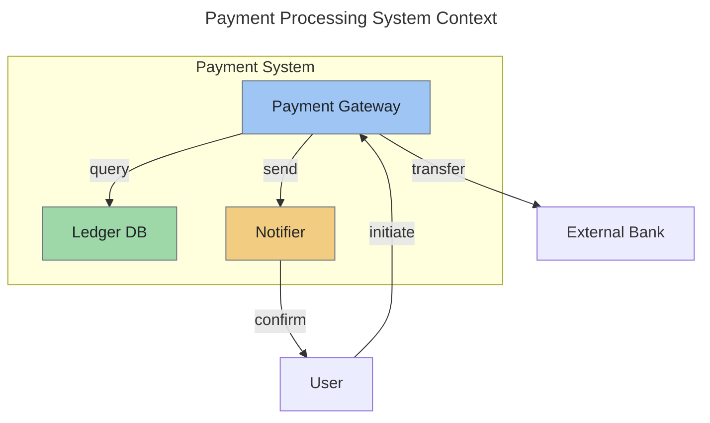

# Mermaid Diagrams Skill

Write Mermaid diagrams as fenced code blocks in Markdown documents. Diagrams stay local, never sent
to an online service.

## Local only

Diagrams live in the document as fenced `mermaid` blocks. Never paste or send diagram source to
mermaid.live, mermaid.ink, Kroki, or any other online renderer, editor, or API, and never generate
diagram image files through an online service. Do not install tools or use `npx`.

## Colors that work in light and dark themes

Never set `theme` (not in frontmatter config, not via `%%{init}%%`); renderers such as GitHub
follow the reader's theme for diagrams that do not choose one. Unstyled parts (edges, labels, subgraph boxes) adapt by
themselves. To give a node meaning-carrying color, use ONLY this palette and always set fill,
stroke, and color together in a `classDef`:

- stroke `#6e7781`, text `#1f2328` for every class
- blue `#9ec5f4`, green `#9fd8a8`, amber `#f2cc80`, red `#f2a9a0`, purple `#c9b2ee`, gray `#c4cbd3`

Measured contrast (WCAG): text on every fill >= 8.2:1; stroke vs white canvas 4.55:1 and vs GitHub
dark canvas #0d1117 4.16:1. Color encodes meaning only (e.g. red = failure path), never decoration.
No pure white or black fills.

## Right angles

Mermaid 12 defaults to the ELK layout, which routes edges orthogonally with rounded corners: leave
the layout and curve defaults alone. Do not set `curve` (tested with mmdc 12.0.0: `curve: step` on
Dagre produces more crossings and overlapping edges). Never use curvy options (`basis`, `natural`).
Sequence diagrams are already rectilinear. These results come from mmdc 12.0.0 only; the Mermaid
version GitHub bundles may differ and was not tested.

## Few crossing lines

Declare nodes in layer order (top layer first); keep edges between adjacent layers; group related
nodes in `subgraph`; keep back-edges rare. If crossings cannot be avoided, split the diagram into
two. After rendering locally (see references), look at the picture and restructure if edges cross
avoidably.

## Choose the diagram type

| Type | Purpose |
| --- | --- |
| `flowchart` / `graph` | Processes, workflows, and architecture |
| `sequenceDiagram` | Interactions and flows over time |
| `erDiagram` | Data models and relationships |
| `C4Context` or `C4Container` | System context and containers |
| `stateDiagram-v2` | Lifecycles and state machines |
| `classDiagram` | Type structure and inheritance |
| `gantt` | Schedules and timelines |

## Workflow

1. Pick the diagram type (table above).
2. Write the block with a title in frontmatter (`title:`), labeled edges, and the palette rules.
3. Run the optional local check (references/local-validation.md).
4. Fix and re-run until clean.

## Optional local validation

If `mmdc` (mermaid-cli) is available locally, render to a temporary directory (never into the
repo), once light and once dark, then look at both images for legibility and avoidable crossings.
If `mmdc` is not available, apply the syntax pitfalls checklist by reading instead. See
references/local-validation.md for exact commands and where to look.

## Example: system context diagram

## References

Read these when you need help or are debugging a diagram:

- **references/syntax-pitfalls.md** — read when a diagram fails to render or produces a misleading
  picture; troubleshoot with concrete bad/fixed pairs
- **references/local-validation.md** — read when you want to check a diagram locally before
  committing; covers mmdc options, light/dark rendering, and what to look for in the images
