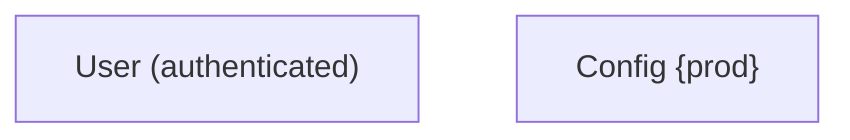
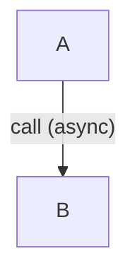
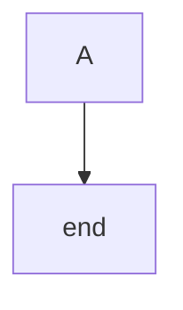
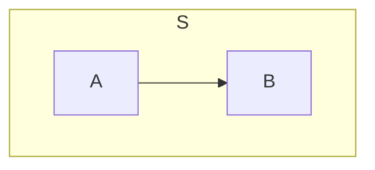
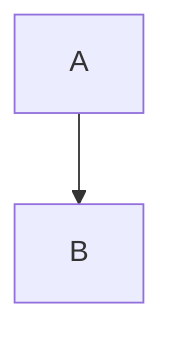
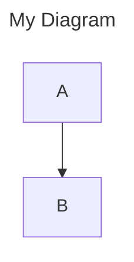
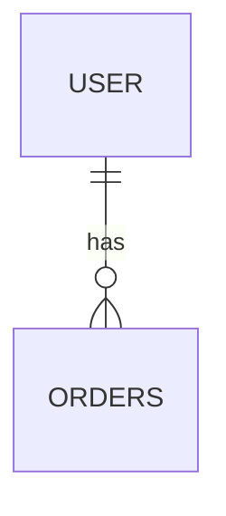
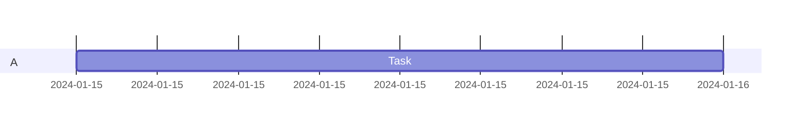

# Syntax Pitfalls and Fixes

Common errors that break rendering, with verified examples from Mermaid 12.0.0. Each pitfall
shows the code that fails (BAD:) and the corrected version (FIXED:).

## Table of Contents

- [Special characters in labels](#special-characters-in-labels)
- [Node ID keyword conflict](#node-id-keyword-conflict)
- [Unclosed blocks](#unclosed-blocks)
- [Trailing comments](#trailing-comments)
- [Frontmatter placement](#frontmatter-placement)
- [ER cardinality syntax](#er-cardinality-syntax)
- [Gantt date format](#gantt-date-format)

## Special characters in labels

### Parentheses and braces in node labels

Parentheses, braces, and quotes inside node labels must be quoted.

BAD:

```mermaid
flowchart TD
    A[User (authenticated)]
    B[Config {prod}]
```

FIXED:



### Parentheses in edge labels

Parentheses in edge label text must also be quoted.

BAD:

```mermaid
flowchart TD
    A -->|call (async)| B
```

FIXED:



## Node ID keyword conflict

The keyword `end` cannot be used as a node ID. Use a different ID and label it with the text you
want to display.

BAD:

```mermaid
flowchart TD
    A --> end
```

FIXED:



## Unclosed blocks

Subgraphs, conditionals in sequence diagrams, and other blocks must have closing `end` keywords.

BAD:

```mermaid
flowchart TD
    subgraph S
        A --> B
```

FIXED:



## Trailing comments

Comments must be on their own line. A `%%` comment after a statement causes a parse error.

BAD:

```mermaid
flowchart TD
    A --> B  %% trailing comment
```

FIXED:



## Frontmatter placement

Frontmatter (title and config) must be the first thing in the diagram block. A comment or blank
line before `---` breaks parsing.

BAD:

```mermaid
%% Comment before frontmatter
---
title: My Diagram
---
flowchart TD
    A --> B
```

FIXED:



## ER cardinality syntax

Entity-relationship diagrams use specific cardinality symbols between entity names. Valid tokens:

- `||` (exactly one)
- `|o` or `o|` (zero or one)
- `}o` or `o{` (zero or more)
- `}|` or `|{` (one or more)

BAD:

```mermaid
erDiagram
    USER ||--{ ORDERS : has
```

FIXED:



## Gantt date format

Gantt chart dates must use valid date formats (ISO 8601 like `2024-01-15`, or keywords like
`today`). Invalid date strings raise a runtime error.

BAD:

```mermaid
gantt
    section A
    Task :notadate, 1d
```

FIXED:


